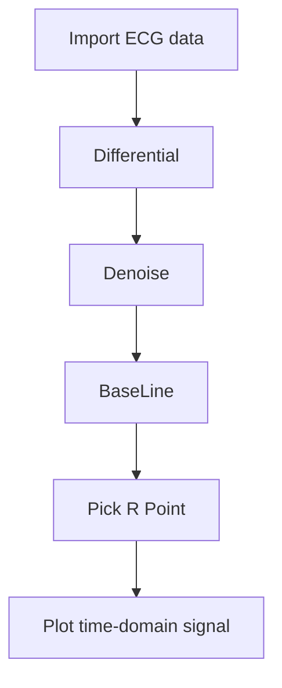
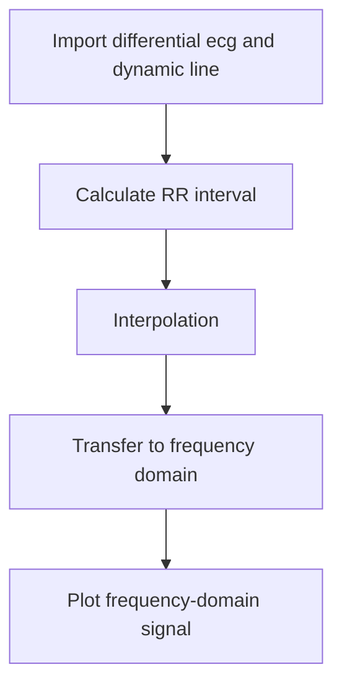

<p align=center>

</p>

<p align=center>
<a target="badge" href="https://github.com/LowSugarCoke/Pixiv-Downloader/blob/main/img/banner.png" title="python version"></a>
<a target="badge" href="https://github.com/LowSugarCoke/RPG-Game" title="visual studio version" title="os:windows"></a>  
</p>

>Heart rate variability (HRV) is the physiological phenomenon of variation in the time interval between heartbeats. It is measured by the variation in the beat-to-beat interval.


## Download source code
In order to analysis hrv, make sure that you have python 3.9.7 and python packages as below:
* numpy 1.21.4
* matplotlib 3.5.0
* PyWavelets 1.2.0
* scipy 1.7.3

```
$ git clone https://github.com/LowSugarCoke/HRV_python
```

## Usage
### Visual Studio Code
Download VSCode https://code.visualstudio.com/

Download python https://www.python.org/

After installing VScode and Python, download the extension in VSCode as follow:
* python
* python for vscode
* code runner

Done it and Run code


## Introduction
### Time-Domain Processing



### Frequency-Domain Processing


